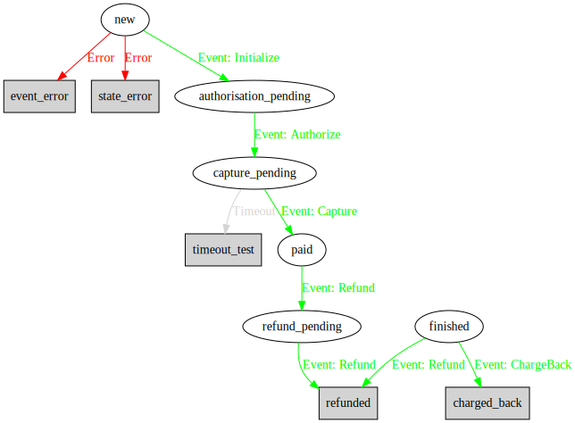

=====
Usage
=====

Tuco's state machines are declared as classes and they must have a container object, it can be a simple object
or a class which represents the model in a database. The idea is that it will only mutate the inner object if the
event is allowed to be executed:

.. code-block:: python

    from tuco import FSM, properties

    class ExampleCreditCardFSM(FSM):
        """Credit card FSM."""

        # You can customize the initial state of your state machine
        initial_state = 'new'
        # The attribute in your model which holds the current state of it
        state_attribute = 'current_state'

        # Final states don't have any attribute and cannot be changed from it to another state
        event_error = properties.FinalState()
        state_error = properties.FinalState()

        # The state names are the same as the attribute name
        new = properties.State(
            # States can have events which change it to other states
            events=[
                properties.Event(
                    # Events must have a name but potentially they could also be an enum
                    'Initialize',
                    # When executed, this event will change to a state and it *MUST* be present in the class
                    # the meta class which generates the FSM class will make sure you put a right value
                    'authorisation_pending',
                    # In case of any error you can force it ot go to a state no matter what
                    error=properties.Error('event_error')
                )
            ],
            # Errors can exist per event or per state
            error=properties.Error('state_error')
        )

        authorisation_pending = properties.State(
            events=[
                properties.Event(
                    'Authorize',
                    'capture_pending',
                )
            ],
        )

        capture_pending = properties.State(
            events=[
                properties.Event('Capture', 'paid'),
            ],
            # States can have a timeout which is useful in this case when a payment was never captured so you could
            # cancel an order or send an email to alert people
            timeout=properties.Timeout(timedelta(days=7), 'timeout_test'),
            # In case you want to call something when the state machine is changed to this state
            on_enter=[lambda object_holder: True]
        )

        timeout_test = properties.FinalState()

        paid = properties.State(
            events=[
                properties.Event('Refund', 'refund_pending',
                                 # You can specify commands to run when an event is executed, in this case could be
                                 # a call to the credit card company to refund the order
                                 commands=[lambda object_holder: True]),
            ]
        )

        finished = properties.State(
            events=[
                properties.Event('ChargeBack', 'charged_back'),
                properties.Event('Refund', 'refunded'),
            ]
        )

        refund_pending = properties.State(
            events=[
                properties.Event('Refund', 'refunded'),
            ]
        )

        refunded = properties.FinalState()
        charged_back = properties.FinalState()

The state machine will be validated when it gets parsed by Python interpreter and below you can find a visual
representation of this state machine.

And to actually use the state machine you can construct it with an object holder/database model.

.. code-block:: python

    class Order(db.Model):
        """An example order class."""
        current_state = db.Column(db.String())
        current_state_date = db.Column(db.Timestamp(True))

    order = Order(current_state='new')
    fsm = ExampleCreditCardFSM(order)
    fsm.trigger('Initialize')
    fsm.trigger('Authorize')
    fsm.trigger('Capture')

----------------
Example snippets
----------------
Here are some usage examples based in a SQLAlchemy environment, they should be adapted to your code reality.

Implementing FSM changelog
==========================

In case you need to audit changes in an object which store states you can use some decorators and make it happen quite
easily.

.. code-block:: python

    from tuco.decorators import on_change

    class FSMLog(db.Model):
        """A SQLAlchemy table which could have all the changes of a state machine."""
        old_state = db.Column(db.String)
        new_state = db.Column(db.String)
        table = db.Column(db.String)
        table_id = db.Column(db.Integer)

    class YourLoggingFSM(FSM):
        """All your classes would need to subclass this afterwards."""

        @property
        def current_time(self):
            """Set all dates to UTC so we can calculate dates before committing to the database."""
            return super().current_time.replace(tzinfo=pytz.UTC)

        @on_change
        def log_changes(self, old_state, new_state):
            """After every successful state change this method will be called.

            :param old_state: A shallow copy of the holder object.
            :param new_state: The changed version of the object holder.
            """
            if not new_state.id:
                db.session.add(new_state)
                db.session.flush()

            initial_state = 'initial_state'
            old_state = old_state.current_state or initial_state
            new_state = new_state.current_state

            log = FSMLog(old_state=old_state, new_state=new_state,
                         table=self.container_object.__tablename__, table_id=self.container_object.id)

            db.session.add(log)
            db.session.flush()

Implementing a timeout tracker
==============================

In case you want to keep track of all objects that are in a specific state where it has a timeout configured you can use
this example to save in a table where you could have a worker to pull them and do the required work.

.. code-block:: python

    from inspect import isclass
    from tuco.decorators import on_change

    def fully_qualified_name(cls_or_instance):
        """Full qualified name of a class or instance.

        :param cls_or_instance: Class or instance
        :return str: Full qualified name
        """
        if not isclass(cls_or_instance):
            cls_or_instance = cls_or_instance.__class__

        return cls_or_instance.__module__ + '.' + cls_or_instance.__qualname__

    class FSMTimeout(db.Model):
        """A SQLAlchemy table which could have all objects in a specific state where there is a timeout configured."""

        fsm_class = db.Column(db.String)
        model_class = db.Column(db.String)
        current_state = db.Column(db.String)
        model_id = db.Column(db.Integer)

    class TimeoutTrackerFSM(FSM):
        """All your classes would need to subclass this afterwards."""

        @on_change()
        def track_timeout(self, old_state, new_state):
            """After every successful state change this method will be called.

            :param old_state: A shallow copy of the holder object.
            :param new_state: The changed version of the object holder.
            """
            if not new_state.id:
                db.session.add(new_state)
                db.session.flush()

            # This is used in case you need to import the fsm_class back again and it would store the whole path of the
            # class like `tuco.some.fsm.CreditCardFSM`.
            fsm_class = fully_qualified_name(self)
            model_class = fully_qualified_name(self.container_object)

            # First delete timeout of old states attached to this object.
            if old_state != initial_state and getattr(self._states[old_state], 'timeout'):
                FSMTimeout.query.filter_by(
                    fsm_class=fsm_class, model_class=model_class,
                    current_state=old_state, model_id=self.container_object.id).delete()

            # Add a new timeout for the current object
            if getattr(self.current_state_instance, 'timeout', None):
                timeout = FSMTimeout(
                    fsm_class=fsm_class, model_class=model_class,
                    model_id=self.container_object.id, current_state=new_state,
                    time_to_execute=(datetime.utcnow().replace(tzinfo=pytz.UTC) +
                                     self.current_state_instance.timeout.timedelta))
                db.session.add(timeout)

Using events with enums instead of simple strings
=================================================

In case you want to have a sane event naming, probably it is better to use constants or Python's enum module.
Here is a simple python3.6+ example::

    import enum
    from datetime import datetime

    from tuco import FSM, properties

    class Holder:
        id: int
        current_state: str
        current_state_date: datetime

        def __init__(self, id, current_state, current_state_date):
            self.id = id
            self.current_state = current_state
            self.current_state_date = current_state_date

    class Events(enum.Enum):
        start = enum.auto()
        finish = enum.auto()

    class SomeFSM(FSM):
        new = properties.State(events=[properties.Event(Events.start, 'started')])
        started = properties.State(events=[properties.Event(Events.finish, 'finished')])
        finished = properties.FinalState()

    holder = Holder(1, 'new', datetime.utcnow())
    fsm = SomeFSM(holder)
    assert fsm.trigger(Events.start)
    assert fsm.current_state == 'started'
    assert len(fsm.possible_events) == 1
    assert fsm.possible_events[0].event_name == Events.finish
    assert fsm.trigger(Events.finish)
    assert fsm.current_state == 'finished'
